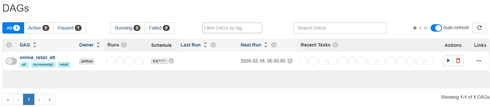

## Virtual environement


### Delete broken .conda folder

Remove-Item -Recurse -Force .\.conda

### (Re)create it properly with venv

python -m venv .conda

### Activate scripts

.\.conda\Scripts\activate

### Remove the old venv

Remove-Item -Recurse -Force H:\TRAINING\DATA_ANALYST\WCS_PROJECT3_ENV

### Create a new Conda environment at the same location

conda create --prefix H:\TRAINING\DATA_ANALYST\WCS_PROJECT3_ENV python=3.11 -y

### Activate it

conda activate H:\TRAINING\DATA_ANALYST\WCS_PROJECT3_ENV

(H:\TRAINING\DATA_ANALYST\WCS_PROJECT3_ENV) PS H:\TRAINING\...>

```

Then in VSCode press `Ctrl+Shift+P` → `Python: Select Interpreter` → `Enter interpreter path` → paste:
```

H:\TRAINING\DATA_ANALYST\WCS_PROJECT3_ENV\python.exe

conda activate H:\TRAINING\DATA_ANALYST\WCS_PROJECT3_ENV
pip install **-**r requirements**.**txt

..\WCS_PROJECT3_ENV\Scripts\activate

### Install your dependencies

pip install -r requirements.txt

```

After activation you should see:
```

## Requirements

pip freeze > requirements.txt

# Airflow

## Part 1

1. install docker
2. After installation, verify everything is running:

**docker** --version
**docker** compose version

3. Create .env file
4. Create key
5. Create dockerfile
6. Create dock-compose.yml

in docker/

7. Launch

```
# Build your custom image
docker compose -f docker/docker-compose.yml build

# Initialize Airflow (run once)
docker compose -f docker/docker-compose.yml run --rm airflow-init

# Start everything
docker compose -f docker/docker-compose.yml up -d

# Stop everything
docker compose -f docker/docker-compose.yml down

# See logs if anything goes wrong:
docker compose -f docker/docker-compose.yml logs -f
```

8. Verify your `src/` is accessible inside the container

`docker exec -it docker-airflow-scheduler-1 bash `

`ls /opt/airflow/src `

`ls /opt/airflow/data`


## Part 2: Watermark / Incremental Logic

1. Create `src/utils/watermark.py`

## Understand the two types of watermarks

You'll use one of two strategies depending on the data source:

**Timestamp-based** — used when your data has a date/time column like `InvoiceDate`. You store the last processed date and next run you only fetch rows where `InvoiceDate > last_processed_date`.

**ID-based** — used when your data has a sequential integer ID. You store the last processed ID and next run you only fetch rows where `id > last_id`.

For your Online Retail dataset, you'll use **timestamp-based** on `InvoiceDate`. For your API calls, we'll use timestamp too (only call the API for records created after the last run).

## Step 3 — Create the db connection helper

Create `src/utils/db.py`:

```
import sqlite3
import os

DB_PATH = os.environ.get("DB_PATH", "data/database/warehouse.db")

def get_connection() -> sqlite3.Connection:
    """Returns a SQLite connection with row factory enabled (rows behave like dicts)."""
    conn = sqlite3.connect(DB_PATH)
    conn.row_factory = sqlite3.Row
    conn.execute("PRAGMA journal_mode=WAL")  # Better concurrency for SQLite
    return conn
```

The `PRAGMA journal_mode=WAL` line is a SQLite performance setting — it allows reads and writes to happen without blocking each other, which matters when Airflow's scheduler and your tasks access the DB simultaneously.

# Docker

docker compose -f docker/docker-compose.yml down
docker compose -f docker/docker-compose.yml build --no-cache
docker compose -f docker/docker-compose.yml run --rm airflow-init
docker compose -f docker/docker-compose.yml up -d

docker exec -it docker-airflow-scheduler-1 **bash**
airflow dags list

Activate container: 

docker exec **-**it docker-airflow-scheduler-1 bash

Check version and dags available: 

python -c **"import numpy; print(numpy.__version__)"**
python -c **"import pyarrow; print(pyarrow.__version__)"**
python -c **"import pandas; print(pandas.__version__)"**
airflow dags list


```
dag_id            | fileloc                      | owners  | is_paused
==================+==============================+=========+==========
online_retail_etl | /opt/airflow/dags/etl_dag.py | airflow | True
```


Open [http://localhost:8080](http://localhost:8080) in your browser, log in with `admin/admin`, then:

1. Find `online_retail_etl` in the DAG list
2. Click the **toggle** on the left to unpause it
3. Click the **▶ Trigger DAG** button (play icon on the right)
4. Click on the DAG name to open it, then click **Graph** to watch tasks execute in real time

Each task will turn **green** when successful or **red** if it fails. If anything turns red, click on the failed task → **Logs** to see the exact error.




# Connect to SQLite3 database with PowerBi

## Step 1 — Install the SQLite ODBC Driver

Download and install the SQLite ODBC driver for Windows:

* Go to [http://www.ch-werner.de/sqliteodbc/](http://www.ch-werner.de/sqliteodbc/)
* Download **sqliteodbc_w64.exe** (64-bit version)
* Run the installer


`<span><span>Driver={SQLite3 ODBC Driver};Database=H:\TRAINING\DATA_ANALYST\WCS_PROJECT3_ONLINE_RETAIL_II_ETL_EDA_RFM\data\database\DATAWAREHOUSE_ONLINE_RETAIL_II.db;</span></span>`


## Step 2 — Connect in PowerBI Desktop

1. Open **PowerBI Desktop**
2. Click **Get Data** → **More**
3. Search for **ODBC** → select it → click **Connect**
4. In the dropdown select **SQlite3 Datasource**
5. If it doesn't appear in the dropdown, click **Advanced options** and paste this connection string:
